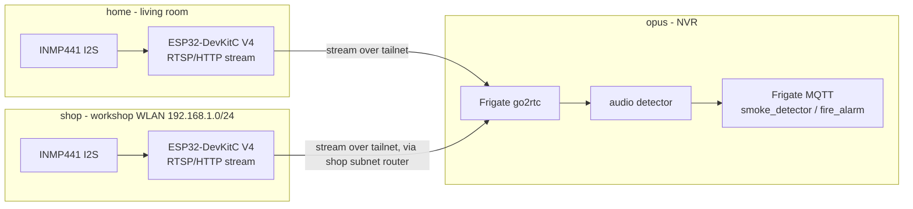

# Smoke detection via an INMP441 I2S microphone

Workspace/branch: `add-smoke-detection-via-INMP441`. wtg space at `~/workspace/add-smoke-detection-via-INMP441`, repo worktree `github.com/uhlig-it/infrastructure`.

## Goal

Add INMP441 I2S MEMS microphones so Frigate can raise `smoke_detector` / `fire_alarm` audio events for the smoke detectors. Each sensor is a self-contained **ESP32 node** that publishes its microphone on the network; the single Frigate at `opus` consumes the streams as audio sources. Everything is deployed from this repo. Status: planned; two sites — the living room at home and the workshop at the shop.

## Why an ESP32 node instead of wiring the mic to the Pi

The I2S bus is a short-range link: its bit clock runs at ~3 MHz (48 kHz × 64), so the mic must sit within a few centimetres of its host — ≤10–15 cm ideal, ~20–30 cm marginal, and unreliable past ~0.5 m. Wiring the INMP441 straight to a Raspberry Pi therefore pins the microphone to wherever the Pi happens to be, which for a smoke detector is the wrong place.

An ESP32 (a few euros, Wi-Fi built in) captures the mic locally over that short I2S run and puts the audio on the network instead; only network latency remains, which at ~32 kB/s (16 kHz mono) is irrelevant. So **both** sites use an ESP32 sensor node: at home the detector is in the living room (no camera, and far from any server), and in the shop it is on the workshop WLAN, away from the Pis. The Raspberry Pi prototype recorded below proved the mic and the mic→go2rtc→RTSP→Frigate shape; the ESP32 replaces it as the deployment.

## Decisions

- **Sensor node: ESP32-DevKitC V4** (Espressif, ESP32-WROOM-32). One per site, powered from a USB supply and joined to the local WLAN.
- **Mic: INMP441**, on the ESP32's I2S0 peripheral, wired with a short harness (see the wiring table).
- **Transport: a dedicated RTSP/HTTP streamer firmware** on the ESP32 — *not* ESPHome (ESPHome reads the mic but has no audio *server*), chosen so Frigate's bundled go2rtc can pull it like any camera. The firmware is not yet selected (see Open questions).
- **Auth: HTTP Basic** on the stream. Sufficient because the stream is only pulled by `opus` over the tailnet (and, in the shop, only across the shop-router WLAN), so the WLAN/tailnet is the trust boundary rather than the credential. Use an isolated/IoT SSID where practical, and upgrade to Digest if the chosen firmware supports it.
- **Stable addressing: a DHCP reservation** — in the shop via `github.com/uhlig-it/shop-router` (`hosts.yml`, installed by `configure.sh`); at home via the router's reservation or a static IP — so the Frigate URL never moves.
- **Reachability (shop): over the tailnet, via `shop`'s subnet router.** The workshop WLAN *is* the `shop-router` LAN, `192.168.1.0/24`; `shop` advertises that route and `opus` runs `--accept-routes`, so `opus` reaches a `192.168.1.x` ESP32 directly and Frigate pulls its stream with no relay on `shop`/`pascal`.
- **Single Frigate, at `opus`.** Both sensors feed it: the living-room node as audio-only (there is no camera there), the workshop node alongside the `werkstatt` camera's audio.
- **Frigate camera vars: refactor** them out of the vaulted `inventory/host_vars/opus/secrets.yml` into plaintext `inventory/host_vars/opus/main.yml`, bridging only the MQTT password from the vault. Camera URLs are not secret; this avoids editing the vault on every camera change.
- **Detection only** for now; no alerting integration yet.
- **Unlock gating (shop only):** the shop stream is disabled by the same `disarmed` profile that motion already uses (Frigate profiles can override the `audio` section); `shop-alarm` already switches the profile on lock/unlock, so it needs no change. The home node listens continuously.
- **Repo: keep everything in `infrastructure`.** No application code — hardware enablement, a thin stream, and config — so this matches the consolidation principle in `docs/consolidation-plan.md`.
- **Retire the Pi path.** The `i2s-mic` role's boot-config tasks and `ha-kiosk`'s go2rtc mic stream are superseded by the ESP32 node; `ha-kiosk`'s Pi audio config is to be reverted once a node is proven.

## Architecture

## INMP441 wiring (ESP32-DevKitC V4)

| INMP441 | ESP32-DevKitC V4 | Notes |
| --- | --- | --- |
| VDD | 3V3 | 3V3 only — never 5V |
| GND | GND | |
| L/R | GND | selects the left channel |
| SCK (BCLK) | IO26 | bit clock (ESP32 output) |
| WS (LRCLK) | IO25 | word select (ESP32 output) |
| SD (DIN) | IO33 | mic data into the ESP32 |

The diagram is rendered by [wiregen](https://github.com/WeebLabs/wiregen) from [`roles/i2s-mic/inmp441-esp32.yaml`](../roles/i2s-mic/inmp441-esp32.yaml), using the `suhlig/wiregen` fork until its new INMP441, Raspberry Pi 3 and ESP32-DevKitC V4 parts are merged upstream. It lives with the role directory (see Phase 0); the earlier INMP441→Pi 3 diagram is superseded.

## Facts already gathered

- **Pi prototype (superseded):** `ha-kiosk` (Pi 4, Debian trixie) ran the INMP441 directly — the `i2s-mic` role set `dtoverlay=googlevoicehat-soundcard` + `dtparam=audio=off` in `/boot/firmware/config.txt`, `arecord -l` showed `card 0: snd_rpi_googlevoicehat_soundcard`, and go2rtc published `rtsp://ha-kiosk:8554/mic` (AAC 48 kHz mono, left channel) with its listeners bound to the tailnet address. This proved the mic and the mic→go2rtc→RTSP→Frigate shape. Under the ESP32 decision it is retired.
- **Workshop WLAN / reachability (verified):** the workshop WLAN is the `shop-router` LAN, `192.168.1.0/24`. `shop` advertises that route (`--advertise-routes=192.168.1.0/24 --accept-routes`) and `opus` accepts routes (`--accept-routes`), so `opus` reaches it. `http://192.168.1.10/` (a Tasmota plug on that LAN) answers `401` with `WWW-Authenticate: Basic realm="Login Required"`, confirming the route is approved *and* that a Basic-auth device is reachable from the tailnet. `shop`'s `net.ipv4.ip_forward` is `1`.
- **DHCP reservations (shop):** `github.com/uhlig-it/shop-router` holds `hosts.yml` (`name`/`mac`/`ip`), applied by `configure.sh`; adding the ESP32 is one entry.
- **Frigate:** runs `ghcr.io/blakeblackshear/frigate:stable` (0.15) with a USB Coral at `opus`; cameras come from `frigate.cameras` (currently vaulted in `inventory/host_vars/opus/secrets.yml`) and are rendered by `roles/frigate/templates/config.yml.j2`, which emits only `detect` + `record`. Audio labels `smoke_detector` and `fire_alarm` exist; profiles can override the `audio` section.

## Work plan

### Phase 0 — role scaffold + Pi prototype (done; superseded)

The `i2s-mic` role directory was created to hold the wiring diagram; the INMP441→Pi 3 diagram (wiregen) was added and CI-rendered. On `ha-kiosk` the boot config was set, a reboot loaded the overlay, and `arecord -l` confirmed the capture card. This validated the microphone. The diagram now targets the ESP32; the Pi boot-config work remains only as history.

### Phase 1 — the i2s-mic role's tasks (done; superseded)

The role manages the Pi's boot config (`/boot/firmware/config.txt` on Bookworm, `/boot/config.txt` on bullseye): `dtparam=audio=off`, `dtoverlay=googlevoicehat-soundcard`, keep `i2c_arm=on`, a reboot handler, and an `arecord -l` assertion. Superseded by the ESP32 node; to be retired (and `ha-kiosk`'s Pi audio config reverted) once a node is proven.

### Phase 2 — the Pi audio stream (done; superseded)

go2rtc on `ha-kiosk` published the mic as `rtsp://ha-kiosk:8554/mic` using an ffmpeg `exec:` source (native `alsa:` only emits raw S16LE and go2rtc's `ffmpeg:` source would not produce), AAC mono, with the listeners tailnet-bound. Superseded: with a streaming ESP32 the stream originates at the node and no go2rtc runs on the sensor side.

### Phase 3 — ESP32 sensor node (current)

- Select and flash the streamer firmware (see Open questions), supporting HTTP Basic auth and an RTSP (or HTTP-AAC) output URL.
- Wire the INMP441 per the diagram; power the board; join the WLAN.
- Give the node a stable address: a reservation in `shop-router/hosts.yml` for the shop; a reservation or static address at home.
- Prove `opus` can pull it over the tailnet (`ffprobe`/`ffplay` the URL) before touching Frigate.

### Phase 4 — Frigate audio detection

- Refactor `frigate.cameras` into plaintext `host_vars/opus/main.yml`, bridging the MQTT password from the vault.
- Add the living-room node to `opus` as an **audio-only** source (go2rtc source + `ffmpeg` input with `roles: [audio]`, `audio: { enabled: true, listen: [smoke_detector, fire_alarm], min_volume: <tuned> }`); settle how an audio-only source is presented (see Open questions).
- Attach the workshop node to the `werkstatt` camera's `audio` role the same way.
- Extend `roles/frigate/templates/config.yml.j2` to emit these optional per-camera audio inputs.
- Add `audio: { enabled: false }` to the `disarmed` profile (shop only).
- Deploy and tune `min_volume`.

### Phase 5 — alerting (later)

Wire `shop-alarm`/HA to act on Frigate `smoke_detector`/`fire_alarm` events. Depends on the separate alerting work already noted in `docs/consolidation-plan.md`.

## Open questions

- **Streamer firmware:** which OSS RTSP/HTTP audio streamer, whether it offers Digest auth, a stable RTSP URL, and buffering that survives Wi-Fi jitter. To select and prove on the bench.
- **Audio-only in Frigate:** Frigate normally ties audio to a camera that also has video, but the living room has no camera. Decide how to expose the node to `opus` — a synthetic/placeholder detect input, or an audio-only camera if Frigate 0.15 accepts one.
- **`min_volume`:** unknown until we can sample the detectors; tune on the node.
- **`i2s-mic` role disposition:** once the ESP32 path works, decide whether to delete the role (its directory would then hold only the wiring diagram) and where the diagram should live.

## Related / out of scope

- The TSL2561 lux sensor moved to `uhlig-it/lux-sensor` (an ESPHome config); `env-sensors` and `host_vars/shop` still carry stale TSL2561 wiring. See `docs/consolidation-plan.md`.
