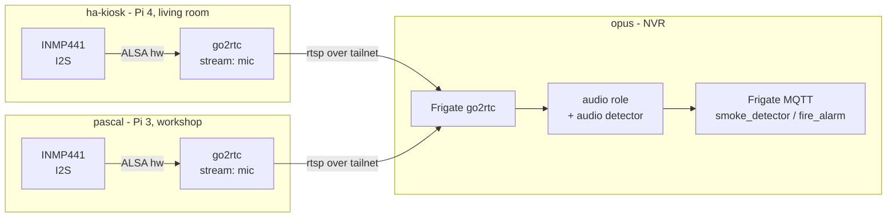

# Smoke detection via an INMP441 I2S microphone

Workspace/branch: `add-smoke-detection-via-INMP441`. wtg space at `~/workspace/add-smoke-detection-via-INMP441`, repo worktree `github.com/uhlig-it/infrastructure`.

## Goal

Add an INMP441 I2S MEMS microphone so Frigate can raise `smoke_detector` / `fire_alarm` audio events for the smoke detectors. Everything deployed via Ansible. Status: planned; the first sensor is at home (`ha-kiosk`), the shop follows via `pascal`.

## Decisions

- **First sensor: `ha-kiosk`** (the Home Assistant touch kiosk, living room) — the production detector. It hosts the working INMP441 (`card 0: snd_rpi_googlevoicehat_soundcard`); its audio is published over RTSP and feeds the single Frigate at `opus` as an **audio-only** source, because there is no camera in the living room.
- **Second sensor: `pascal`** (the 24/7 print server, workshop) — replication, not the first host. A second INMP441 adds a **shop-audio** stream to the same `opus` Frigate; `pascal` already runs `go2rtc` for the `printer` camera, so it needs no new streaming service.
- **Boot config: the new local role `i2s-mic`** manages the boot config — `/boot/firmware/config.txt` on Bookworm and `/boot/config.txt` on bullseye — setting `dtparam=audio=off` (frees the I2S/PCM block the onboard `bcm2835` audio uses) and adding `dtoverlay=googlevoicehat-soundcard`, keeping `dtparam=i2c_arm=on`. A reboot is required. The role directory also holds the wiring diagram.
- **I2C and I2S coexist.** The BME280/TSL2561 use I2C1 (GPIO2/3); I2S uses GPIO18/19/20. Different pins and peripherals, so only the onboard audio is disabled, not I2C. (`pascal` has no I2C sensors anyway.)
- **Audio path: mic → `go2rtc` → RTSP → Frigate (a single Frigate, at `opus`).** Each sensor host publishes its mic with `go2rtc` (e.g. `mic: alsa:hw:<card>,0`); the `opus` Frigate pulls both over the tailnet — `ha-kiosk` for living-room audio, `pascal` for shop audio. `pascal`'s stream attaches to the `werkstatt` camera's `audio` role; the living-room mic has no camera (see Open questions).
- **Frigate camera vars: refactor** them out of the vaulted `inventory/host_vars/opus/secrets.yml` into plaintext `inventory/host_vars/opus/main.yml`, bridging only the MQTT password from the vault. Camera URLs are not secret; this avoids editing the vault on every camera change.
- **Detection only** for now; no alerting integration yet.
- **Unlock gating (shop only):** the shop streams are disabled by the same `disarmed` profile that motion already uses (Frigate profiles can override the `audio` section); `shop-alarm` already switches the profile on lock/unlock, so it needs no change. `ha-kiosk` (home) listens continuously. Consequence: shop `min_volume` tuning only has to behave while the shop is locked.
- **Repo: keep everything in `infrastructure`.** No application code — hardware enablement, a thin stream, and config — so this matches the consolidation principle in `docs/consolidation-plan.md`. A separate repo would only add a release/CI pipeline for nothing.

## Architecture

## INMP441 wiring (Pi 3 / Pi 4)

| INMP441 | Pi pin | BCM |
| --- | --- | --- |
| VDD | 1 | 3V3 |
| GND | 6 | GND |
| L/R | 9 | GND (selects left channel) |
| SCK (BCLK) | 12 | GPIO18 |
| WS (LRCLK) | 35 | GPIO19 |
| SD (DIN) | 38 | GPIO20 |

The wiring diagram is rendered by [wiregen](https://github.com/WeebLabs/wiregen) from [`roles/i2s-mic/inmp441-pi3.yaml`](../roles/i2s-mic/inmp441-pi3.yaml), using the `suhlig/wiregen` fork until its new INMP441 and Raspberry Pi 3 parts are merged upstream. It lives with the role it documents; see [`roles/i2s-mic/README.md`](../roles/i2s-mic/README.md) and Phase 0.

## Facts already gathered

- `ha-kiosk` (first sensor) is a **Pi 4** on Debian trixie, managed as the `pi` user. The `i2s-mic` role has been applied: `dtoverlay=googlevoicehat-soundcard` + `dtparam=audio=off` in `/boot/firmware/config.txt`, and `arecord -l` now shows `card 0: snd_rpi_googlevoicehat_soundcard`. The card exposes **no ALSA mixer controls**, so any gain must be digital.
- `ha-kiosk` publishes the mic as `rtsp://ha-kiosk:8554/mic` (**AAC 48 kHz mono**) through `go2rtc`: the native `alsa:` source only emits raw S16LE (`format S16LE not supported` over RTSP) and go2rtc's `ffmpeg:` source would not produce, so the stream uses an ffmpeg `exec:` source that takes the left channel as mono (`exec:ffmpeg -f alsa -i plughw:0,0 -af pan=mono|c0=c0 -c:a aac -vn -f mpegts -`). go2rtc's listeners are bound to the Tailscale address (`go2rtc_listen`), so the streams and the exec-capable API are reachable over the tailnet only.
- `pascal` (second sensor) is a **Pi 3 on Raspbian bullseye** (kernel 6.1); its boot config is `/boot/config.txt` (not `/boot/firmware/`), and `googlevoicehat-soundcard.dtbo` is present. No capture card yet.
- `shop` is a Pi 3 Model B Rev 1.2, Raspbian 12 Bookworm, kernel 6.12 (`+rpt-rpi-v7`). `pascal` is a Pi 3 as well.
- `shop` `/boot/firmware/config.txt`: `dtparam=i2c_arm=on`, `dtparam=audio=on`, `#dtparam=i2s=on` (commented), `dtoverlay=vc4-kms-v3d`, `camera_auto_detect=1`. Nothing manages `config.txt` in Ansible today.
- `arecord -l` on `shop`: no capture device (only playback: `bcm2835 Headphones`, `vc4-hdmi`).
- `ffmpeg 5.1`, `arecord`, `aplay` present on `shop`; `mediamtx` active (camera path `cam`, `all_others` publish open).
- Overlays available: `googlevoicehat-soundcard.dtbo`, `audioinjector-bare-i2s.dtbo`, `i2s-*.dtbo` (fallbacks if `googlevoicehat-soundcard` misbehaves).
- Frigate runs `ghcr.io/blakeblackshear/frigate:stable` (0.15 schema) with a USB Coral; cameras come from `frigate.cameras` (vaulted, `inventory/host_vars/opus/secrets.yml`) and are rendered by `roles/frigate/templates/config.yml.j2`, which currently emits only `detect` + `record` inputs.
- Frigate audio labels include `smoke_detector` ("smoke detector beeps") and `fire_alarm` ("fire and smoke alarm sirens"); profiles can override the `audio` section.

## Work plan

### Phase 0 — role scaffold + prototype

Create the `i2s-mic` role directory and put the wiring diagram in it (the wiregen source `inmp441-pi3.yaml` plus its rendered `inmp441-pi3.svg`). The diagram belongs with the role it documents, and the role directory is needed from the outset to hold it.

On the chosen prototype host, add the two `config.txt` lines, reboot, confirm `arecord -l` shows a capture card, and record a sample. Settle the overlay (`googlevoicehat-soundcard` vs `dtparam=i2s=on` + `audioinjector-bare-i2s`) and the ALSA device id.

### Phase 1 — the role's tasks

The `i2s-mic` role manages the boot config (`/boot/firmware/config.txt` on Bookworm, `/boot/config.txt` on bullseye): `dtparam=audio=off`, `dtoverlay=googlevoicehat-soundcard`, keep `i2c_arm=on`, a reboot handler, and an `arecord -l` assertion. This also closes the general gap that the boot config was unmanaged (even `i2c_arm` was only set by hand). Applied to `ha-kiosk`; `pascal` (bullseye path) is still to do.

### Phase 2 — the audio stream

On `ha-kiosk`, `go2rtc` is installed (role added to `playbooks/machines/ha-kiosk.yml`) and publishes the mic as `rtsp://ha-kiosk:8554/mic`. The native `alsa:` source only emits raw S16LE (go2rtc rejects it over RTSP: `format S16LE not supported`) and go2rtc's `ffmpeg:` source would not produce, so the stream reads ALSA through an explicit ffmpeg `exec:` source emitting AAC in MPEG-TS (`exec:ffmpeg -f alsa -i plughw:0,0 -c:a aac -vn -f mpegts -`). Verified: the RTSP stream is AAC 48 kHz mono (left channel), and the go2rtc listeners are bound to the Tailscale address (`go2rtc_listen`) so streams and the API are tailnet-only. Replicate on `pascal` for shop audio afterwards (same approach).

### Phase 3 — Frigate audio detection

- Refactor: move `frigate.cameras` to plaintext `inventory/host_vars/opus/main.yml`, bridging the MQTT password from the vault.
- Add `ha-kiosk`'s living-room mic to the single `opus` Frigate as an audio source: a go2rtc stream plus an `ffmpeg` input with `roles: [audio]`, and `audio: { enabled: true, listen: [smoke_detector, fire_alarm], min_volume: <tuned> }`. Settle how to present an audio-only source (see Open questions).
- Attach `pascal`'s shop-audio stream to the `werkstatt` camera's `audio` role the same way.
- Extend `roles/frigate/templates/config.yml.j2` to emit these optional per-camera audio inputs.
- Add `audio: { enabled: false }` to the `disarmed` profile (shop only).

### Phase 4 — alerting (later)

Wire `shop-alarm`/HA to act on Frigate `smoke_detector`/`fire_alarm` events. Depends on the separate alerting work already noted in `docs/consolidation-plan.md`.

## Open questions

- **Audio-only in Frigate:** Frigate ties audio to a camera that also has video (a detect stream), but the living room has no camera. Decide how to expose `ha-kiosk`'s mic to the single `opus` Frigate — a dedicated camera with a synthetic/placeholder detect input, or another approach.
- **`min_volume`:** unknown until we can sample the detectors; tune on the prototype.
- **Reboot timing:** the `i2s-mic` role reboots on change; done on `ha-kiosk`, but on `pascal` do it between prints.
- **`shop` disposition:** `shop` keeps its I2C sensors unchanged; its unmanaged boot config is still worth closing separately.

## Related / out of scope

- The TSL2561 lux sensor moved to `uhlig-it/lux-sensor` (an ESPHome config); `env-sensors` and `host_vars/shop` still carry stale TSL2561 wiring. See `docs/consolidation-plan.md`.
