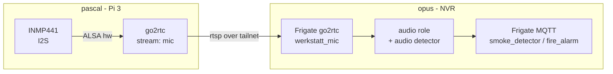

# Smoke detection via an INMP441 I2S microphone

Workspace/branch: `add-smoke-detection-via-INMP441`. wtg space at `~/workspace/add-smoke-detection-via-INMP441`, repo worktree `github.com/uhlig-it/infrastructure`.

## Goal

Add an INMP441 I2S MEMS microphone so Frigate can raise `smoke_detector` / `fire_alarm` audio events for the smoke detectors. Everything deployed via Ansible. Status: planned; prototype at home first, then `pascal`.

## Decisions

- **Host: `pascal`** (the 24/7 print server). It already runs `go2rtc` (role in this repo), Frigate already consumes an RTSP stream from it (`printer`), and it is more reliable than `shop`. `go2rtc` supports a direct `alsa:` source, so no separate streaming unit is needed.
- **Prototype first on `kiosk`** (home), with a second INMP441, then replicate on `pascal`. The home unit may stay as a smoke detector there. `kiosk` details are open (see Open questions).
- **Boot config: a new local role here** manages `/boot/firmware/config.txt`: set `dtparam=audio=off` (frees the I2S/PCM block that the onboard `bcm2835` audio uses) and add `dtoverlay=googlevoicehat-soundcard`; keep `dtparam=i2c_arm=on`. A reboot is required.
- **I2C and I2S coexist.** The BME280/TSL2561 use I2C1 (GPIO2/3); I2S uses GPIO18/19/20. Different pins and peripherals, so only the onboard audio is disabled, not I2C. (`pascal` has no I2C sensors anyway.)
- **Audio path: mic → RTSP → Frigate.** On `pascal`, a `go2rtc` stream (e.g. `mic: alsa:hw:<card>,0`) publishes the mic; Frigate's own go2rtc pulls it, and the `werkstatt` camera gets an `ffmpeg` input with the `audio` role.
- **Frigate camera vars: refactor** them out of the vaulted `inventory/host_vars/opus/secrets.yml` into plaintext `inventory/host_vars/opus/main.yml`, bridging only the MQTT password from the vault. Camera URLs are not secret; this avoids editing the vault on every camera change.
- **Detection only** for now; no alerting integration yet.
- **Unlock gating:** audio detection is disabled by the same `disarmed` profile that motion already uses (Frigate profiles can override the `audio` section). `shop-alarm` already switches the profile on lock/unlock, so it needs no change. Consequence: `min_volume` tuning only has to behave while the shop is locked.
- **Repo: keep everything in `infrastructure`.** No application code — hardware enablement, a thin stream, and config — so this matches the consolidation principle in `docs/consolidation-plan.md`. A separate repo would only add a release/CI pipeline for nothing.

## Architecture

## INMP441 wiring (Pi 3)

| INMP441 | Pi pin | BCM |
| --- | --- | --- |
| VDD | 1 | 3V3 |
| GND | 6 | GND |
| L/R | 9 | GND (selects left channel) |
| SCK (BCLK) | 12 | GPIO18 |
| WS (LRCLK) | 35 | GPIO19 |
| SD (DIN) | 38 | GPIO20 |

## Facts already gathered

- `shop` is a Pi 3 Model B Rev 1.2, Raspbian 12 Bookworm, kernel 6.12 (`+rpt-rpi-v7`). `pascal` is a Pi 3 as well.
- `shop` `/boot/firmware/config.txt`: `dtparam=i2c_arm=on`, `dtparam=audio=on`, `#dtparam=i2s=on` (commented), `dtoverlay=vc4-kms-v3d`, `camera_auto_detect=1`. Nothing manages `config.txt` in Ansible today.
- `arecord -l` on `shop`: no capture device (only playback: `bcm2835 Headphones`, `vc4-hdmi`).
- `ffmpeg 5.1`, `arecord`, `aplay` present on `shop`; `mediamtx` active (camera path `cam`, `all_others` publish open).
- Overlays available: `googlevoicehat-soundcard.dtbo`, `audioinjector-bare-i2s.dtbo`, `i2s-*.dtbo` (fallbacks if `googlevoicehat-soundcard` misbehaves).
- Frigate runs `ghcr.io/blakeblackshear/frigate:stable` (0.15 schema) with a USB Coral; cameras come from `frigate.cameras` (vaulted, `inventory/host_vars/opus/secrets.yml`) and are rendered by `roles/frigate/templates/config.yml.j2`, which currently emits only `detect` + `record` inputs.
- Frigate audio labels include `smoke_detector` ("smoke detector beeps") and `fire_alarm` ("fire and smoke alarm sirens"); profiles can override the `audio` section.

## Work plan

### Phase 0 — prototype (no repo changes)

On the chosen prototype host, add the two `config.txt` lines, reboot, confirm `arecord -l` shows a capture card, and record a sample. Settle the overlay (`googlevoicehat-soundcard` vs `dtparam=i2s=on` + `audioinjector-bare-i2s`) and the ALSA device id.

### Phase 1 — boot-config role (local)

A new local role managing `/boot/firmware/config.txt` (`dtparam=audio=off`, `dtoverlay=googlevoicehat-soundcard`, keep `i2c_arm=on`) with a reboot handler. This also closes the general gap that `config.txt` is currently unmanaged (even `i2c_arm` is only there by hand).

### Phase 2 — the audio stream

On `pascal`, add a `go2rtc_streams` entry for the mic (the role already supports arbitrary sources and pascal already has a static ffmpeg). Fall back to a small `ffmpeg` systemd unit if go2rtc's ALSA source proves unreliable.

### Phase 3 — Frigate audio detection

- Refactor: move `frigate.cameras` to plaintext `inventory/host_vars/opus/main.yml`, bridging the MQTT password from the vault.
- Extend `roles/frigate/templates/config.yml.j2` with an optional per-camera audio source: a go2rtc stream plus an `ffmpeg` input with `roles: [audio]`, and `audio: { enabled: true, listen: [smoke_detector, fire_alarm], min_volume: <tuned> }`.
- Add `audio: { enabled: false }` to the `disarmed` profile.

### Phase 4 — alerting (later)

Wire `shop-alarm`/HA to act on Frigate `smoke_detector`/`fire_alarm` events. Depends on the separate alerting work already noted in `docs/consolidation-plan.md`.

## Open questions

- **`kiosk`:** what is it (Pi model, OS, tailnet membership, `ansible_user`)? Is it already fleet-managed in `inventory/hosts.yml`, or does it need adding? Does it feed `opus`'s Frigate (home) or its own? The prototype depends on these.
- **`min_volume`:** unknown until we can sample the detectors; tune on the prototype.
- **Reboot timing:** enabling I2S needs a reboot; on `pascal` do it between prints.
- **`shop` disposition:** if `pascal` hosts the mic, `shop` keeps its I2C sensors unchanged; the unmanaged `shop` `config.txt` is still worth closing separately.

## Related / out of scope

- The TSL2561 lux sensor moved to `uhlig-it/lux-sensor` (an ESPHome config); `env-sensors` and `host_vars/shop` still carry stale TSL2561 wiring. See `docs/consolidation-plan.md`.
